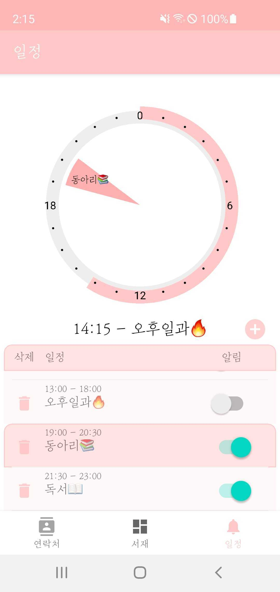
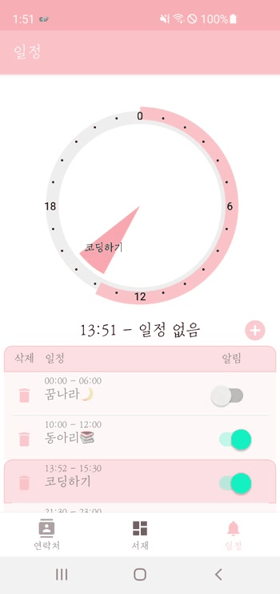
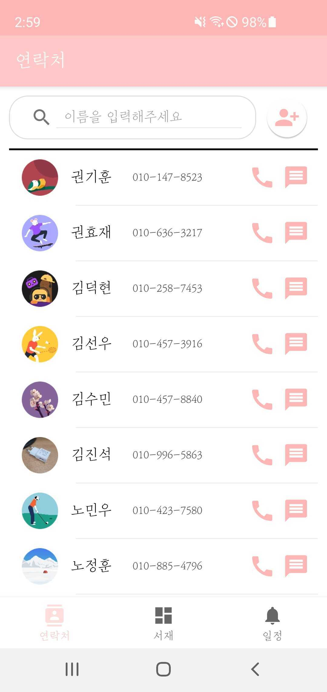
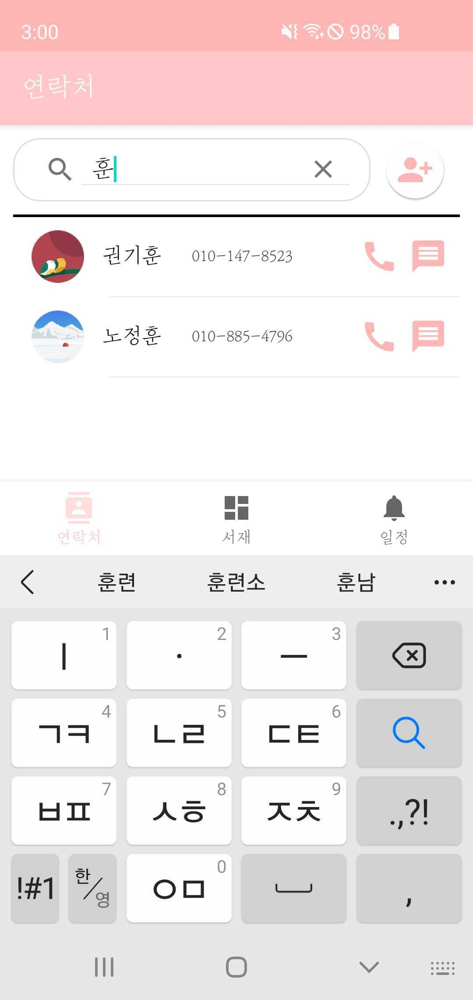

# MBTI.

**M**anagement of **B**ooks, **T**ime schedules & **I**nteraction.

## Summary.


라이프 스타일을 관리하기 위한 3가지 탭이 있는 애플리케이션.

### Books

#### First,


서재 탭의 첫 화면입니다.

개발자의 pick, 20가지 책 글귀가 초기 이미지로 수록되어 있습니다.

서재의 썸네일 이미지들은 원본 이미지에서 중심 부분을 1:1 비율로 보여줍니다.


두 손가락으로 확대 및 축소도 가능합니다.

#### Load Image

새로운 글을 가져오려면, 첫번째 카메라 이미지를 클릭합니다.


##### Load From Camera


카메라로 찍어서 글귀를 가져올 수 있습니다.

##### Load From Gallery


이미 갤러리에 존재하는 글을 새로 가져올 수도 있습니다.

#### Get Text

각각의 글을 클릭하면, 크게 글을 볼 수 있는 창으로 갑니다.


버튼을 클릭하여 글귀를 가져옵니다.


글귀를 보고 생각한 내용을 따로 메모해둘 수도 있습니다.

삭제 버튼을 누르면 글을 삭제하고,

확인 버튼을 눌러 원래 화면으로 돌아갑니다.

책을 읽을 때 기억해두고 싶은 내용들을 저장하고, 메모해두세요.
기록을 통해 기억력의 한계를 극복할 수 있습니다.

### Time schedules

*Time schedules* 탭은 원형 스케줄러의 방식으로 사용자가 일정을 직접 관리하는 기능을 제공합니다.

| | | || 
| :-: | :-: | :-: | :-: |

1. 현재 시각을 스케줄러의 외각바가 채워진 정도로 표현하고, 현재 시각과 해당하는 일정을 스케줄러 아래쪽에 표시
2. 각 일정을 클릭할 경우, 스케줄러에서 확인하기 쉽도록 해당 일정만 표시
3. 일정 추가는 일정 이름, 시작 시간, 종료 시간, 알림 여부 설정하여 등록
4. 알림 설정 시, 일정이 시작하는 시간에 알림이 발생

### Interaction

*Interaction* 탭은 스마트폰 연락처의 기능을 제공합니다.

| | | | 
| :-: | :-: | :-: |


1. 스마트폰에 저장된 연락처를 불러와서 이미지, 이름, 번호를 표시하고, 우측의 전화/메시지 버튼을 통하여 해당 기능을 연결
2. 우측 상단의 연락처 추가 아이콘을 통하여 연락처 추가를 하는 기능을 연결
3. 기존 연락처에 저장된 이미지가 없을 경우 기본 이미지를 표시
4. 검색창에 글자를 입력하여 즉각적으로 이름과 일치하는 연락처를 필터링
5. 연락처를 선택할 경우, 오른쪽 이미지와 창을 표시하여 세부 정보와 수정/삭제 가능

## Implementation.

android studio의 bottom navigation activity 템플릿을 이용하여,
MainActivity 상에서 Fragment 전환만으로 기능하는 애플리케이션입니다.

### Books

서재의 이미지 뷰는 그리드 뷰로 구현하였습니다.

#### 파일 저장 및 불러오기

이미지 원본, 썸네일 이미지, OCR로 가져온 이미지 텍스트, 메모 텍스트 모두 
<code>getFilesDir()</code>를 이용하여 app의 저장소에 저장했습니다.

*GalleryFragment.onCreateView* 
```java
    public View onCreateView(@NonNull LayoutInflater inflater,
                             ViewGroup container, Bundle savedInstanceState) {
        MainActivity activity = (MainActivity) getActivity();
        Context context = container.getContext();

        ViewGroup rootView = (ViewGroup) inflater.inflate(R.layout.fragment_gallery, container, false);

        m_grid = rootView.findViewById(R.id.grid_gallery);
        OnPinchListener onPinchListener = new OnPinchListener();
        ScaleGestureDetector scaleGestureDetector = new ScaleGestureDetector(context, onPinchListener);
        m_grid.setOnTouchListener((v, event) -> {
            scaleGestureDetector.onTouchEvent(event);
            return false;
        });

        m_grid.setOnItemClickListener((parent, view, position, id) -> {
            if (position == CAMERA_BUTTON_POSITION)
                cameraOnClick();
            else
                thumbnailOnClick(position);
        });

        m_gallAdt = new GalleryAdapter(context, activity);

        try {
            AssetManager am = context.getAssets();
            BufferedInputStream buf;
            Bitmap bitmap;
            buf = new BufferedInputStream(am.open("camera.png"));
            bitmap = BitmapFactory.decodeStream(buf);
            m_gallAdt.setItem(bitmap);
            buf.close();

            int count = 1;
            while (true) {
                File filesDir = getActivity().getFilesDir();
                File file = new File(filesDir, "thumbnail" + count + ".png");
                if (file.exists()) {
                    bitmap = BitmapFactory.decodeFile(file.getPath());
                    m_gallAdt.setItem(bitmap);
                    count++;
                } else break;
            }
        } catch (Exception e) {
            e.printStackTrace();
        }

        m_grid.setAdapter(m_gallAdt);

        return rootView;
    }
```
Fragment의 onCreate함수에서 각 이미지의 썸네일을 불러와 이미지뷰로 보여주고, 어댑터를 설정합니다.

#### pinch zoom

*GalleryFragment.onPinchListener* 
```java
    private class OnPinchListener extends ScaleGestureDetector.SimpleOnScaleGestureListener {
        @RequiresApi(api = Build.VERSION_CODES.JELLY_BEAN_MR1)
        @Override
        public boolean onScale(ScaleGestureDetector detector) {
            float scaleFactor = detector.getScaleFactor();
            int colNumDif = -1 * (int) ((scaleFactor - 1) * 12);
            int newColNum = m_grid.getNumColumns() + colNumDif;
            if (newColNum <= 1) m_grid.setNumColumns(1);
            else if (newColNum >= m_gallAdt.getCount()) m_grid.setNumColumns(m_gallAdt.getCount());
            else m_grid.setNumColumns(newColNum);
            return true;
        }
    }
```
두 손가락을 이용한 확대, 축소 기능인 핀치 줌은 
그리드 뷰에 적용하여, 손가락 너비를 계산하여 gridView의 column개수를 변화시키는 방식으로 구현했습니다.

#### 새로운 이미지 불러오기

``` java
        Activity activity = getActivity();
        AlertDialog.Builder builder = new AlertDialog.Builder(activity);
        builder.setMessage("새로 스크랩 하기");
        builder.setNegativeButton("카메라로 찍기", (dialog, which) -> {
            getCameraPermission(activity, context);
            Intent intent = new Intent(MediaStore.ACTION_IMAGE_CAPTURE);
            startActivityForResult(intent, CAMERA_REQUEST);
        });

        builder.setPositiveButton("갤러리에서 가져오기", (dialog, which) -> {
            getGalleryPermission(activity, context);
            Intent intent = new Intent();
            intent.setType("image/*");
            intent.setAction(Intent.ACTION_GET_CONTENT);
            startActivityForResult(intent, GALLERY_REQUEST);
        });


@RequiresApi(api = Build.VERSION_CODES.JELLY_BEAN_MR1)
    @Override
    public void onActivityResult(int requestCode, int resultCode, @Nullable Intent data) {
        Bitmap bm = null;
        if (requestCode == GALLERY_REQUEST && resultCode == RESULT_OK) {
            try {
                InputStream is = getContext().getContentResolver().openInputStream(data.getData());
                bm = BitmapFactory.decodeStream(is);
                is.close();

                File filesDir = getActivity().getFilesDir();
                File file = new File(filesDir, "img" + m_gallAdt.getCount() + ".png");
                FileOutputStream out = new FileOutputStream(file);
                bm.compress(Bitmap.CompressFormat.PNG, 100, out);
                out.flush();
                out.close();
                refresh();
            } catch (Exception e) {
                e.printStackTrace();
            }
        } else if (requestCode == CAMERA_REQUEST && resultCode == RESULT_OK) {
            try {
                Bundle extras = data.getExtras();
                bm = (Bitmap) extras.get("data");

                File filesDir = getActivity().getFilesDir();
                File file = new File(filesDir, "img" + m_gallAdt.getCount() + ".png");
                FileOutputStream out;
                out = new FileOutputStream(file);
                bm.compress(Bitmap.CompressFormat.PNG, 100, out);
                out.flush();
                out.close();
                refresh();
            } catch (Exception e) {
                e.printStackTrace();
            }
        }
        try {
            File filesDir = getActivity().getFilesDir();
            File thumbnailOut = new File(filesDir, "thumbnail" + m_gallAdt.getCount() + ".png");
            FileOutputStream out = null;

            out = new FileOutputStream(thumbnailOut);

            Bitmap thumbnail = Device.createThumbnail(bm, getActivity());
            thumbnail.compress(Bitmap.CompressFormat.PNG, 100, out);
            out.flush();
            out.close();
            m_gallAdt.setItem(thumbnail);
        } catch (FileNotFoundException e) {
            e.printStackTrace();
        } catch (IOException e) {
            e.printStackTrace();
        }
    }
```

alertDialog로 dialog에서 버튼 클릭을 통해, 각각 카메라, 갤러리 액티비티로 가고,

<code>onActivityResult()</code> 함수로 받아온 이미지를 처리하고, 썸네일을 새로 만들어 저장합니다.

#### Memo

이미지의 텍스트는 <code>Google Vision API</code> 의 <code>OCR vision</code> 을 이용합니다.

<code>google api package</code> 에서 함수를 import하여, bitmap 데이터를 http요청으로 보내고, 응답을 받아와 String으로 파싱을 진행합니다.

메모 텍스트는 editText로 입력 받고, 확인 버튼을 누를 시 메모 텍스트와 OCR 텍스트가 저장됩니다.

삭제 버튼을 누르면, 이미지 파일, 썸네일 파일에 더하여 만약 있다면, OCR, memo 텍스트도 삭제됩니다.

### Time schedules

1. 원형 스케줄러

    원형 스케줄러는 스케줄러 외각 부분과 내부 부분으로 나누어 Canvas 위에 그리는 방식으로 구현하였습니다.

    외각 부분은 현재 시각을 백분율로 계산하여 그 값에 해당하는 각도만큼 호를 그려, 매 초마다 갱신하도록 하였습니다.

    ```java
    int percent = (60 * Integer.parseInt(hourFormat.format((currentTime))) + Integer.parseInt(minFormat.format((currentTime)))) / 4;

    SchedulerCanvas.drawArc(barWidth + 20, barWidth + 20, canvasWidth - barWidth - 20, canvasHeight - barWidth - 20, -90, percent, false, paint);
    ```

     내부 부분은 저장된 일정에서 시작 시간과 종료 시간을 각도로 계산하여 부채꼴을 그리고, 각의 중앙값을 이용하여 좌표를 계산하여 일정 이름을 부채꼴 위에 표현하였습니다.

    ```java
        int posx = (int) (canvasWidth / 2 + r * Math.cos(Math.toRadians(middleAngle - 90)));
        int posy = (int) (canvasHeight / 2 + r * Math.sin(Math.toRadians(middleAngle - 90)));
        SchedulerCanvas.drawText(schedule.getName(), posx, posy + 10, textPaint);
    ```
    

2. 일정 표시

    앱을 종료해도 일정 정보가 유지될 수 있도록 *SharedPreferences*를 이용하여 JSON -> String 형식으로 저장하고 반대로 불러와서 사용하였습니다.
    ```java
    void setArrayListPref(ArrayList<Schedule> schedules){
        SharedPreferences prefs = PreferenceManager.getDefaultSharedPreferences(getContext());
        SharedPreferences.Editor editor = prefs.edit();
        JSONArray jsonArray = new JSONArray();
        for(int i=0;i<schedules.size();i++) jsonArray.put(schedules.get(i).toJsonObject());
        if(!schedules.isEmpty()) editor.putString("schedules", jsonArray.toString());
        else editor.putString("schedules", null);
        editor.apply();

    }

    ArrayList<Schedule> getArrayListPref(){
        SharedPreferences prefs = PreferenceManager.getDefaultSharedPreferences(getContext());
        String json = prefs.getString("schedules", null);
        if(json != null){
            ...

            JSONArray jsonArray = new JSONArray(json);
            for (int i = 0; i< jsonArray.length();i++){
                JSONObject obj = (JSONObject) jsonArray.get(i);
                Schedule s = new Schedule(...);
            ... 
    }
    ```
    getArrayListPref()를 통해서 얻은 일정 데이터를 *recycler view*에 나타내었습니다.


3. 일정 추가 및 삭제

    일정 추가의 경우 중앙 우측의 + 버튼을 터치할 경우 *dialog*를 통하여 일정을 추가할 수 있도록 하였습니다. *dialog*가 닫힐 때 입력 값을 이전 *fragment*에 전달하여 새 일정 오브젝트를 생성하여 *recycler view*의 *adapter*에 추가하고 스케줄러를 다시 그리도록 하였습니다.
    ```java
    scheduleAddBtn.setOnClickListener(v -> new DialogFragment().show(getChildFragmentManager(), "dialog"));

    // dialog result listener
    getChildFragmentManager().setFragmentResultListener("dialog", this, new FragmentResultListener() {
        @Override
        public void onFragmentResult(@NonNull String requestKey, @NonNull Bundle result) {
            ...
            schedules.add(new Schedule(name, sdf.parse(startTime), sdf.parse(endTime), isAlarm));
            Collections.sort(schedules);
            setArrayListPref(schedules);
            adapter.notifyDataSetChanged();
            reDraw(); 
            ...
    });

    ```

    일정 추가 *dialog*에서 시간 범위를 설정하는 time picker의 경우에는 해당 [라이브러리](https://github.com/Droppers/TimeRangePicker)를 이용하여 구현하였습니다. 스케줄러를 만드는데 있어서 날짜가 바뀌는 시간 범위를 허용하지 않게 하기 위해서, 종료 시간이 시작 시간보다 앞서게 되는 경우 두 위치를 강제로 바꾸도록 하였습니다.

    ```java
    @Override
    public void onDragStop(@NonNull TimeRangePicker.Thumb thumb) {
        TimeRangePicker.Time startTime = trp.getStartTime();
        TimeRangePicker.Time endTime = trp.getEndTime();

        if (sdf.format( startTime.getCalendar().getTime())
        .compareTo(sdf.format(endTime.getCalendar().getTime())) > 0) {

            trp.setStartTimeMinutes(endTime.getTotalMinutes());
            trp.setEndTimeMinutes(startTime.getTotalMinutes());
            
            ...
        }
    }
    ```

    위 라이브러리에서 *setEndTime* 메서드에 오류가 있어서 *setEndTimeMinute*로 해결하였습니다.

4. 알림 기능

알림 기능은 ```PendingIntent```를 ```getBroadcast```로 보내고, ```BroadcastReceiver```에서 받음으로써 알림을 발생시킵니다.

*ScheduleAdapter.setNotification*
```java
    public static void setNotification(String when, String title, Activity m_activity) throws ParseException {

        Intent receiverIntent = new Intent(m_activity, AlarmReceiver.class);
        receiverIntent.putExtra("title", title);
        PendingIntent pendingIntent = PendingIntent.getBroadcast(m_activity, title.hashCode(), receiverIntent, 0);

        SimpleDateFormat dateFormat = new SimpleDateFormat("yyyy-MM-dd HH:mm:ss");
        Date date = new Date(System.currentTimeMillis());
        SimpleDateFormat sdf = new SimpleDateFormat("yyyy-MM-dd");
        String getTime = sdf.format(date);

        Log.e("TAG", title);

        when = getTime.concat(" " + when).concat(":00");
        Date datetime = dateFormat.parse(when);
        Log.e("NOTI", "SET:" + datetime.toString());
        Calendar calendar = Calendar.getInstance();
        long repeatInterval = AlarmManager.INTERVAL_DAY;
        long triggerTime = (SystemClock.elapsedRealtime()
                + repeatInterval);
        if (datetime.before(date)) {
            datetime.setTime(date.getTime() + repeatInterval);
        }

        calendar.setTime(datetime);
        AlarmManager alarmManager = (AlarmManager) m_activity.getSystemService(Context.ALARM_SERVICE);


        alarmManager.setInexactRepeating(
                AlarmManager.ELAPSED_REALTIME_WAKEUP,
                triggerTime, repeatInterval,
                pendingIntent
        );

        alarmManager.set(AlarmManager.RTC, calendar.getTimeInMillis(), pendingIntent);
    }
```

시간을 파싱하여 오늘의 해당 시각에 알림을 설정합니다.

각 알림은 알림 명의 ```hashcode```를 이용하여 채널을 구분함으로써 구분 가능합니다.

*AlaramReceiver extends BroadcastReceiver*
```java
package com.example.madcamp_pj1.ui.schedule;

import android.app.Notification;
import android.app.NotificationChannel;
import android.app.NotificationManager;
import android.app.PendingIntent;
import android.content.BroadcastReceiver;
import android.content.Context;
import android.content.Intent;
import android.content.res.AssetManager;
import android.graphics.Bitmap;
import android.graphics.BitmapFactory;
import android.os.Build;
import android.util.Log;

import androidx.core.app.NotificationCompat;

import com.example.madcamp_pj1.MainActivity;
import com.example.madcamp_pj1.R;

import java.io.BufferedInputStream;
import java.io.IOException;

public class AlarmReceiver extends BroadcastReceiver {

    NotificationManager manager;
    NotificationCompat.Builder builder;

    @Override
    public void onReceive(Context context, Intent intent) {

        Intent intent2 = new Intent(context, MainActivity.class);
        String title = intent.getExtras().getString("title");
        PendingIntent pendingIntent = PendingIntent.getActivity(context, title.hashCode(), intent2, PendingIntent.FLAG_UPDATE_CURRENT);
        manager = (NotificationManager) context.getSystemService(Context.NOTIFICATION_SERVICE);
        Log.e("ALARM", title);
        if (Build.VERSION.SDK_INT >= Build.VERSION_CODES.O) {
            if (manager.getNotificationChannel(title) == null) {
                manager.createNotificationChannel(
                        new NotificationChannel(title, title, NotificationManager.IMPORTANCE_DEFAULT)
                );
            }
            builder = new NotificationCompat.Builder(context, title);
        } else {
            builder = new NotificationCompat.Builder(context);
        }
        AssetManager am = context.getAssets();
        BufferedInputStream buf = null;
        try {
            buf = new BufferedInputStream(am.open("logo.png"));
        } catch (IOException e) {
            e.printStackTrace();
        }
        Bitmap bitmap = BitmapFactory.decodeStream(buf);

        builder.setContentTitle(title)
                .setSmallIcon(R.drawable.ic_baseline_chat_bubble_outline_24)
                .setLargeIcon(bitmap)
                .setAutoCancel(true)
                .setContentIntent(pendingIntent);
        Log.e("ALARM", title);
        Notification notification = builder.build();
        manager.notify(title.hashCode(), notification);
    }
}
```
해당 시각이 되면, 알림 채널을 ```hashcode```로 설정하고, ```NotificationCompat.Builder```를 이용하여 알림을 만들어서, 보여줍니다.

### Interaction

1. 연락처 불러오기

    연락처 정보는 쿼리를 아래와 같이 정의한 후, 얻은 결과를 바탕으로 정의한 연락처 오브젝트를 생성하였습니다. 생성된 결과를 *recycler view*에 나타내었습니다.

    ```java
    Uri uri = ContactsContract.CommonDataKinds.Phone.CONTENT_URI;
    String[] projection = new String[]{
            ContactsContract.Contacts._ID,
            ContactsContract.Contacts.PHOTO_ID,
            ContactsContract.CommonDataKinds.Phone.DISPLAY_NAME,
            ContactsContract.CommonDataKinds.Phone.NUMBER,
            ContactsContract.Contacts.LOOKUP_KEY,
    };
    String selection = ContactsContract.CommonDataKinds.Phone.DISPLAY_NAME + " LIKE '%" + name + "%'";
    String sortOrder = ContactsContract.CommonDataKinds.Phone.DISPLAY_NAME + " COLLATE LOCALIZED ASC";

    Cursor cursor = getActivity().getContentResolver().query(uri, projection, selection, null, sortOrder);
    ```

2. 연락처 검색

    검색창(*searchView*)에 입력할 경우, text change listener에서 입력된 값으로 위의 연락처 불러오기를 수행하여 일치하는 값으로 *recycler view*를 업데이트하였습니다.
    
    ```java
    searchView.setOnQueryTextListener(new SearchView.OnQueryTextListener() {
        @Override
        public boolean onQueryTextChange(String newText) {
            searchText = newText;
            contactList = getContactList(newText);
            getContactListAsLog();
            mRecyclerAdapter.notifyDataSetChanged();
            return true;
        }
    });
    ```

3. 연락처 상세보기

    특정 연락처를 터치할 경우, 세부 연락처 정보를 표시하는 *fragment*를 띄우도록 하였습니다. 이 때 *recycler view*에 연결된 *adapter*로부터 선택된 연락처 정보를 *bundle*에 담아서 *ContactDetail fragment*로 전달하였습니다.

    ```java
    FriendItem fi = mRecyclerAdapter.getItem(i);
    Bundle bundle = new Bundle();
    bundle.putParcelable("fi", fi);
    bundle.putInt("pos", i);

    ContactDetailFragment contactDetailFragment = new ContactDetailFragment();
    contactDetailFragment.setArguments(bundle);

    getParentFragmentManager()
            .beginTransaction()
            .add(R.id.nav_host_fragment, contactDetailFragment)
            .setTransition(FragmentTransaction.TRANSIT_FRAGMENT_FADE)
            .commit();
    ```

4. 연락처 추가/수정/삭제

    연락처 추가는 메인 화면에서, 수정 및 삭제는 상세보기 화면에서 이루어지나 해당 기능들의 방법은 유사하게 구현하였습니다.
    
    [안드로이드 개발자 문서](https://developer.android.com/training/contacts-provider/modify-data?hl=ko)에서 권장하는대로 삭제를 제외하고는 가급적 연락처 제공자에 직접 접근하지 않고, *Intent*를 사용하여 연락처 *Activity*를 실행시켰습니다.

    ```java
        Intent intent = new Intent(ContactsContract.Intents.Insert.ACTION);
        intent.setType(ContactsContract.RawContacts.CONTENT_TYPE);
        intent.putExtra("finishActivityOnSaveCompleted", true);
        getResult.launch(intent);
    ```

## How To Use.

Github Actions가 main branch에 commit, pull request이 발생하면 자동으로 build 후 apk파일을 생성합니다.


- actions 탭으로 들어가 주세요.


- workflow 중 최근의 커밋 메시지 명을 클릭해서 들어가 주세요.


- Artifacts 탭의 app을 클릭 시 apk.zip 파일을 다운로드 받으실 수 있습니다.
  
## Made By.

[고려대학교 컴퓨터학과 20학번 노정훈](https://www.github.com/overthestream)

[KAIST 전산학부 17학번 권기훈](https://www.github.com/kyoonkwon)
