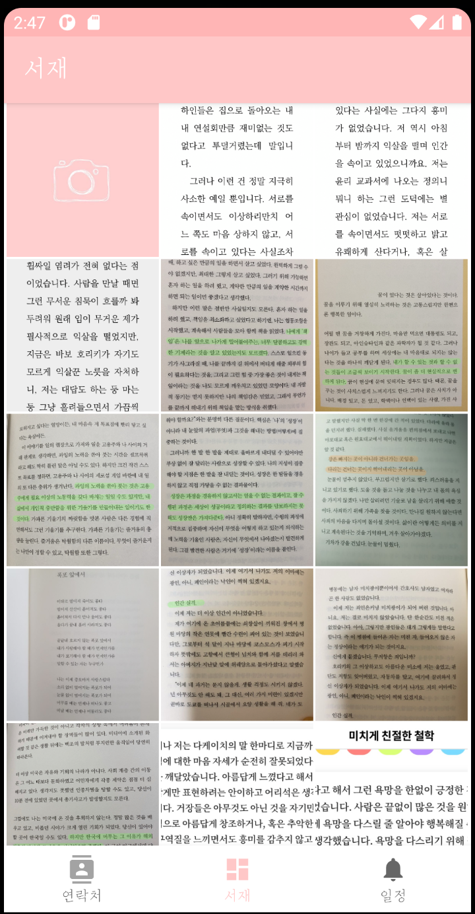
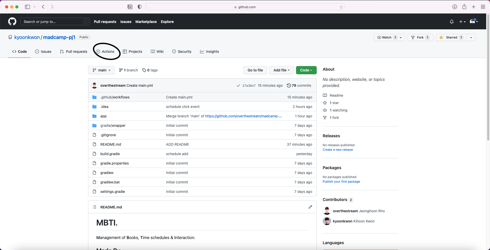
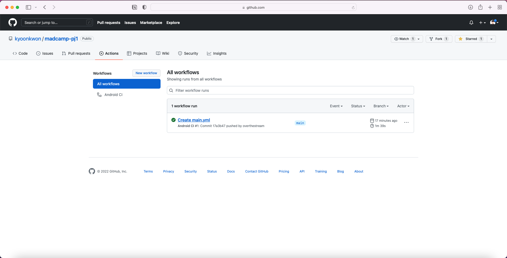
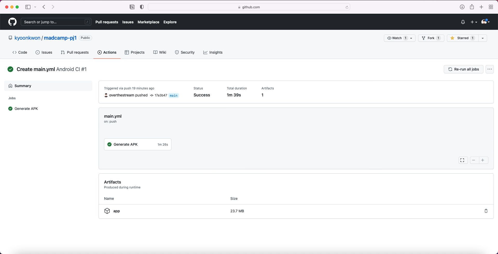

# MBTI.

**M**anagement of **B**ooks, **T**ime schedules & **I**nteraction.

## Summary.

라이프 스타일을 관리하기 위한 3가지 탭이 있는 애플리케이션.

### Books

#### First,



서재 탭의 첫 화면입니다.

개발자의 pick, 20가지 책 글귀가 초기 이미지로 수록되어 있습니다.

서재의 썸네일 이미지들은 원본 이미지에서 중심 부분을 1:1 비율로 보여줍니다.


두 손가락으로 확대 및 축소도 가능합니다.

#### Load Image

새로운 글을 가져오려면, 첫번째 카메라 이미지를 클릭합니다.


##### Load From Camera


카메라로 찍어서 글귀를 가져올 수 있습니다.

##### Load From Gallery


이미 갤러리에 존재하는 글을 새로 가져올 수도 있습니다.

#### Get Text

각각의 글을 클릭하면, 크게 글을 볼 수 있는 창으로 갑니다.


버튼을 클릭하여 글귀를 가져옵니다.


글귀를 보고 생각한 내용을 따로 메모해둘 수도 있습니다.

삭제 버튼을 누르면 글을 삭제하고,

확인 버튼을 눌러 원래 화면으로 돌아갑니다.

책을 읽을 때 기억해두고 싶은 내용들을 저장하고, 메모해두세요.
기록을 통해 기억력의 한계를 극복할 수 있습니다.

### Time schedules

### Interaction

## Implementation.

android studio의 bottom navigation activity 템플릿을 이용하여,
MainActivity 상에서 Fragment 전환만으로 기능하는 애플리케이션입니다.

### Books

서재의 이미지 뷰는 그리드 뷰로 구현하였습니다.

#### 파일 저장 및 불러오기

이미지 원본, 썸네일 이미지, OCR로 가져온 이미지 텍스트, 메모 텍스트 모두 
<code>getFilesDir()</code>를 이용하여 app의 저장소에 저장했습니다.

*GalleryFragment.onCreateView* 
```java
    public View onCreateView(@NonNull LayoutInflater inflater,
                             ViewGroup container, Bundle savedInstanceState) {
        MainActivity activity = (MainActivity) getActivity();
        Context context = container.getContext();

        ViewGroup rootView = (ViewGroup) inflater.inflate(R.layout.fragment_gallery, container, false);

        m_grid = rootView.findViewById(R.id.grid_gallery);
        OnPinchListener onPinchListener = new OnPinchListener();
        ScaleGestureDetector scaleGestureDetector = new ScaleGestureDetector(context, onPinchListener);
        m_grid.setOnTouchListener((v, event) -> {
            scaleGestureDetector.onTouchEvent(event);
            return false;
        });

        m_grid.setOnItemClickListener((parent, view, position, id) -> {
            if (position == CAMERA_BUTTON_POSITION)
                cameraOnClick();
            else
                thumbnailOnClick(position);
        });

        m_gallAdt = new GalleryAdapter(context, activity);

        try {
            AssetManager am = context.getAssets();
            BufferedInputStream buf;
            Bitmap bitmap;
            buf = new BufferedInputStream(am.open("camera.png"));
            bitmap = BitmapFactory.decodeStream(buf);
            m_gallAdt.setItem(bitmap);
            buf.close();

            int count = 1;
            while (true) {
                File filesDir = getActivity().getFilesDir();
                File file = new File(filesDir, "thumbnail" + count + ".png");
                if (file.exists()) {
                    bitmap = BitmapFactory.decodeFile(file.getPath());
                    m_gallAdt.setItem(bitmap);
                    count++;
                } else break;
            }
        } catch (Exception e) {
            e.printStackTrace();
        }

        m_grid.setAdapter(m_gallAdt);

        return rootView;
    }
```
Fragment의 onCreate함수에서 각 이미지의 썸네일을 불러와 이미지뷰로 보여주고, 어댑터를 설정합니다.

#### pinch zoom

*GalleryFragment.onPinchListener* 
```java
    private class OnPinchListener extends ScaleGestureDetector.SimpleOnScaleGestureListener {
        @RequiresApi(api = Build.VERSION_CODES.JELLY_BEAN_MR1)
        @Override
        public boolean onScale(ScaleGestureDetector detector) {
            float scaleFactor = detector.getScaleFactor();
            int colNumDif = -1 * (int) ((scaleFactor - 1) * 12);
            int newColNum = m_grid.getNumColumns() + colNumDif;
            if (newColNum <= 1) m_grid.setNumColumns(1);
            else if (newColNum >= m_gallAdt.getCount()) m_grid.setNumColumns(m_gallAdt.getCount());
            else m_grid.setNumColumns(newColNum);
            return true;
        }
    }
```
두 손가락을 이용한 확대, 축소 기능인 핀치 줌은 
그리드 뷰에 적용하여, 손가락 너비를 계산하여 gridView의 column개수를 변화시키는 방식으로 구현했습니다.

#### 새로운 이미지 불러오기

``` java
        Activity activity = getActivity();
        AlertDialog.Builder builder = new AlertDialog.Builder(activity);
        builder.setMessage("새로 스크랩 하기");
        builder.setNegativeButton("카메라로 찍기", (dialog, which) -> {
            getCameraPermission(activity, context);
            Intent intent = new Intent(MediaStore.ACTION_IMAGE_CAPTURE);
            startActivityForResult(intent, CAMERA_REQUEST);
        });

        builder.setPositiveButton("갤러리에서 가져오기", (dialog, which) -> {
            getGalleryPermission(activity, context);
            Intent intent = new Intent();
            intent.setType("image/*");
            intent.setAction(Intent.ACTION_GET_CONTENT);
            startActivityForResult(intent, GALLERY_REQUEST);
        });


@RequiresApi(api = Build.VERSION_CODES.JELLY_BEAN_MR1)
    @Override
    public void onActivityResult(int requestCode, int resultCode, @Nullable Intent data) {
        Bitmap bm = null;
        if (requestCode == GALLERY_REQUEST && resultCode == RESULT_OK) {
            try {
                InputStream is = getContext().getContentResolver().openInputStream(data.getData());
                bm = BitmapFactory.decodeStream(is);
                is.close();

                File filesDir = getActivity().getFilesDir();
                File file = new File(filesDir, "img" + m_gallAdt.getCount() + ".png");
                FileOutputStream out = new FileOutputStream(file);
                bm.compress(Bitmap.CompressFormat.PNG, 100, out);
                out.flush();
                out.close();
                refresh();
            } catch (Exception e) {
                e.printStackTrace();
            }
        } else if (requestCode == CAMERA_REQUEST && resultCode == RESULT_OK) {
            try {
                Bundle extras = data.getExtras();
                bm = (Bitmap) extras.get("data");

                File filesDir = getActivity().getFilesDir();
                File file = new File(filesDir, "img" + m_gallAdt.getCount() + ".png");
                FileOutputStream out;
                out = new FileOutputStream(file);
                bm.compress(Bitmap.CompressFormat.PNG, 100, out);
                out.flush();
                out.close();
                refresh();
            } catch (Exception e) {
                e.printStackTrace();
            }
        }
        try {
            File filesDir = getActivity().getFilesDir();
            File thumbnailOut = new File(filesDir, "thumbnail" + m_gallAdt.getCount() + ".png");
            FileOutputStream out = null;

            out = new FileOutputStream(thumbnailOut);

            Bitmap thumbnail = Device.createThumbnail(bm, getActivity());
            thumbnail.compress(Bitmap.CompressFormat.PNG, 100, out);
            out.flush();
            out.close();
            m_gallAdt.setItem(thumbnail);
        } catch (FileNotFoundException e) {
            e.printStackTrace();
        } catch (IOException e) {
            e.printStackTrace();
        }
    }
```

alertDialog로 dialog에서 버튼 클릭을 통해, 각각 카메라, 갤러리 액티비티로 가고,

<code>onActivityResult()</code> 함수로 받아온 이미지를 처리하고, 썸네일을 새로 만들어 저장합니다.

#### Memo

이미지의 텍스트는 <code>Google Vision API</code> 의 <code>OCR vision</code> 을 이용합니다.

<code>google api package</code> 에서 함수를 import하여, bitmap 데이터를 http요청으로 보내고, 응답을 받아와 String으로 파싱을 진행합니다.

메모 텍스트는 editText로 입력 받고, 확인 버튼을 누를 시 메모 텍스트와 OCR 텍스트가 저장됩니다.

삭제 버튼을 누르면, 이미지 파일, 썸네일 파일에 더하여 만약 있다면, OCR, memo 텍스트도 삭제됩니다.

### Time schedules

### Interaction


## How To Use.

Github Actions가 main branch에 commit, pull request이 발생하면 자동으로 build 후 apk파일을 생성합니다.



- actions 탭으로 들어가 주세요.



- workflow 중 최근의 커밋 메시지 명을 클릭해서 들어가 주세요.



- Artifacts 탭의 app을 클릭 시 apk.zip 파일을 다운로드 받으실 수 있습니다.
  
## Made By.

[고려대학교 컴퓨터학과 20학번 노정훈](https://www.github.com/overthestream)

[KAIST 전산학부 17학번 권기훈](https://www.github.com/kyoonkwon)