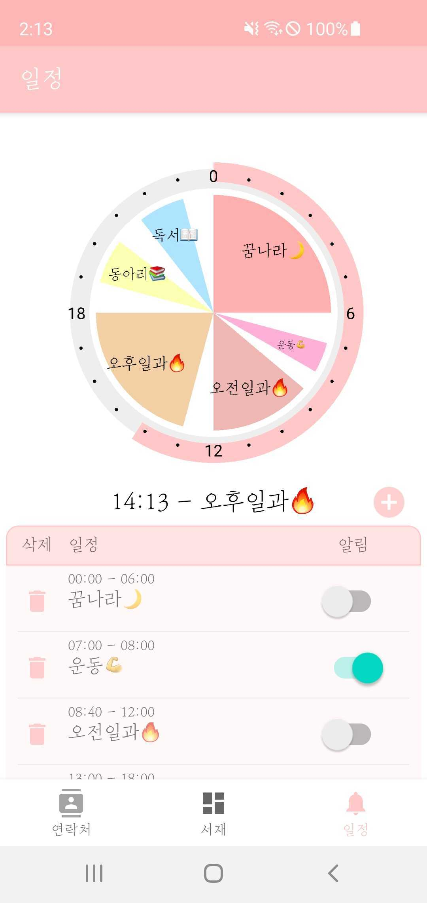

# MBTI.

**M**anagement of **B**ooks, **T**ime schedules & **I**nteraction.

## Made By.

[고려대학교 컴퓨터학과 20학번 노정훈](https://www.github.com/overthestream)

[KAIST 전산학부 17학번 권기훈](https://www.github.com/kyoonkwon)

## Summary.

라이프 스타일을 관리하기 위한 3가지 탭이 있는 애플리케이션.

### Books

### Time schedules

*Time schedules* 탭은 원형 스케줄러의 방식으로 사용자가 일정을 직접 관리하는 기능을 제공

<figure align="center">
    
    
    
    
</figure>

1. 현재 시각을 스케줄러의 외각바가 채워진 정도로 표현하고, 현재 시각과 해당하는 일정을 스케줄러 아래쪽에 표시
2. 각 일정을 클릭할 경우, 스케줄러에서 확인하기 쉽도록 해당 일정만 표시
3. 일정 추가는 일정 이름, 시작 시간, 종료 시간, 알림 여부 설정하여 등록
4. 알림 설정 시, 일정이 시작하는 시간에 알림이 오도록 함

### Interaction

*Interaction* 탭은 스마트폰 연락처의 기능을 제공

<figure align="center">
    
    
    
</figure>

1. 스마트폰에 저장된 연락처를 불러와서 이미지, 이름, 번호를 표시하고, 우측의 전화/메시지 버튼을 통하여 해당 기능을 연결
2. 우측 상단의 연락처 추가 아이콘을 통하여 연락처 추가를 하는 기능을 연결
3. 기존 연락처에 저장된 이미지가 없을 경우 기본 이미지를 표시하도록 함
4. 검색창에 글자를 입력하여 즉각적으로 이름과 일치하는 연락처를 필터링
5. 연락처를 선택할 경우, 오른쪽 이미지와 창을 표시하여 세부 정보와 수정/삭제를 할 수 있도록 함 

## Implementation.

### Books

### Time schedules

1. 원형 스케줄러

    원형 스케줄러는 스케줄러 외각 부분과 내부 부분으로 나누어 Canvas 위에 그리는 방식으로 구현

    외각 부분은 현재 시각을 백분율로 계산하여 그 값에 해당하는 각도만큼 호를 그려, 매 초마다 갱신하도록 함.

    ```java
    int percent = (60 * Integer.parseInt(hourFormat.format((currentTime))) + Integer.parseInt(minFormat.format((currentTime)))) / 4;

    SchedulerCanvas.drawArc(barWidth + 20, barWidth + 20, canvasWidth - barWidth - 20, canvasHeight - barWidth - 20, -90, percent, false, paint);
    ```

     내부 부분은 저장된 일정에서 시작 시간과 종료 시간을 각도로 계산하여 부채꼴을 그리고, 각의 중앙값을 이용하여 좌표를 계산하여 일정 이름을 부채꼴 위에 표현하였음.

    ```java
        int posx = (int) (canvasWidth / 2 + r * Math.cos(Math.toRadians(middleAngle - 90)));
        int posy = (int) (canvasHeight / 2 + r * Math.sin(Math.toRadians(middleAngle - 90)));
        SchedulerCanvas.drawText(schedule.getName(), posx, posy + 10, textPaint);
    ```
    

2. 일정 표시

    앱을 종료해도 일정 정보가 유지될 수 있도록 *SharedPreferences*를 이용하여 JSON -> String 형식으로 저장하고 반대로 불러와서 사용하였음.
    ```java
    void setArrayListPref(ArrayList<Schedule> schedules){
        SharedPreferences prefs = PreferenceManager.getDefaultSharedPreferences(getContext());
        SharedPreferences.Editor editor = prefs.edit();
        JSONArray jsonArray = new JSONArray();
        for(int i=0;i<schedules.size();i++) jsonArray.put(schedules.get(i).toJsonObject());
        if(!schedules.isEmpty()) editor.putString("schedules", jsonArray.toString());
        else editor.putString("schedules", null);
        editor.apply();

    }

    ArrayList<Schedule> getArrayListPref(){
        SharedPreferences prefs = PreferenceManager.getDefaultSharedPreferences(getContext());
        String json = prefs.getString("schedules", null);
        if(json != null){
            ...

            JSONArray jsonArray = new JSONArray(json);
            for (int i = 0; i< jsonArray.length();i++){
                JSONObject obj = (JSONObject) jsonArray.get(i);
                Schedule s = new Schedule(...);
            ... 
    }
    ```
    getArrayListPref()를 통해서 얻은 일정 데이터를 *recycler view*에 나타내었음.


3. 일정 추가 및 삭제

    일정 추가의 경우 중앙 우측의 + 버튼을 터치할 경우 *dialog*를 통하여 일정을 추가할 수 있도록 함. *dialog*가 닫힐 때 입력 값을 이전 *fragment*에 전달하여 새 일정 오브젝트를 생성하여 *recycler view*의 *adapter*에 추가하고 스케줄러를 다시 그리도록 함
    ```java
    scheduleAddBtn.setOnClickListener(v -> new DialogFragment().show(getChildFragmentManager(), "dialog"));

    // dialog result listener
    getChildFragmentManager().setFragmentResultListener("dialog", this, new FragmentResultListener() {
        @Override
        public void onFragmentResult(@NonNull String requestKey, @NonNull Bundle result) {
            ...
            schedules.add(new Schedule(name, sdf.parse(startTime), sdf.parse(endTime), isAlarm));
            Collections.sort(schedules);
            setArrayListPref(schedules);
            adapter.notifyDataSetChanged();
            reDraw(); 
            ...
    });

    ```

    일정 추가 *dialog*에서 시간 범위를 설정하는 time picker의 경우에는 해당 [라이브러리](https://github.com/Droppers/TimeRangePicker)를 이용하여 구현하였음. 스케줄러를 만드는데 있어서 날짜가 바뀌는 시간 범위를 허용하지 않게 하기 위해서, 종료 시간이 시작 시간보다 앞서게 되는 경우 두 위치를 강제로 바꾸도록 하였음.

    ```java
    @Override
    public void onDragStop(@NonNull TimeRangePicker.Thumb thumb) {
        TimeRangePicker.Time startTime = trp.getStartTime();
        TimeRangePicker.Time endTime = trp.getEndTime();

        if (sdf.format( startTime.getCalendar().getTime())
        .compareTo(sdf.format(endTime.getCalendar().getTime())) > 0) {

            trp.setStartTimeMinutes(endTime.getTotalMinutes());
            trp.setEndTimeMinutes(startTime.getTotalMinutes());
            
            ...
        }
    }
    ```

    위 라이브러리에서 *setEndTime* 메서드에 오류가 있어서 *setEndTimeMinute*로 해결함.

4. 알림 기능

### Interaction

1. 연락처 불러오기

    연락처 정보는 쿼리를 아래와 같이 정의한 후, 얻은 결과를 바탕으로 정의한 연락처 오브젝트를 생성. 생성된 결과를 *recycler view*에 나타냄.

    ```java
    Uri uri = ContactsContract.CommonDataKinds.Phone.CONTENT_URI;
    String[] projection = new String[]{
            ContactsContract.Contacts._ID,
            ContactsContract.Contacts.PHOTO_ID,
            ContactsContract.CommonDataKinds.Phone.DISPLAY_NAME,
            ContactsContract.CommonDataKinds.Phone.NUMBER,
            ContactsContract.Contacts.LOOKUP_KEY,
    };
    String selection = ContactsContract.CommonDataKinds.Phone.DISPLAY_NAME + " LIKE '%" + name + "%'";
    String sortOrder = ContactsContract.CommonDataKinds.Phone.DISPLAY_NAME + " COLLATE LOCALIZED ASC";

    Cursor cursor = getActivity().getContentResolver().query(uri, projection, selection, null, sortOrder);
    ```

2. 연락처 검색

    검색창(*searchView*)에 입력할 경우, text change listener에서 입력된 값으로 위의 연락처 불러오기를 수행하여 일치하는 값으로 *recycler view*를 업데이트함.
    
    ```java
    searchView.setOnQueryTextListener(new SearchView.OnQueryTextListener() {
        @Override
        public boolean onQueryTextChange(String newText) {
            searchText = newText;
            contactList = getContactList(newText);
            getContactListAsLog();
            mRecyclerAdapter.notifyDataSetChanged();
            return true;
        }
    });
    ```

3. 연락처 상세보기

    특정 연락처를 터치할 경우, 세부 연락처 정보를 표시하는 *fragment*를 띄우도록 함. 이 때 *recycler view*에 연결된 *adapter*로부터 선택된 연락처 정보를 *bundle*에 담아서 *ContactDetail fragment*로 전달하였음.

    ```java
    FriendItem fi = mRecyclerAdapter.getItem(i);
    Bundle bundle = new Bundle();
    bundle.putParcelable("fi", fi);
    bundle.putInt("pos", i);

    ContactDetailFragment contactDetailFragment = new ContactDetailFragment();
    contactDetailFragment.setArguments(bundle);

    getParentFragmentManager()
            .beginTransaction()
            .add(R.id.nav_host_fragment, contactDetailFragment)
            .setTransition(FragmentTransaction.TRANSIT_FRAGMENT_FADE)
            .commit();
    ```

4. 연락처 추가/수정/삭제

    연락처 추가는 메인 화면에서, 수정 및 삭제는 상세보기 화면에서 이루어지나 해당 기능들의 방법은 유사하게 구현하였음. 
    
    [안드로이드 개발자 문서](https://developer.android.com/training/contacts-provider/modify-data?hl=ko)에서 권장하는대로 삭제를 제외하고는 가급적 연락처 제공자에 직접 접근하지 않고, *Intent*를 사용하여 연락처 *Activity*를 실행시켰음.

    ```java
        Intent intent = new Intent(ContactsContract.Intents.Insert.ACTION);
        intent.setType(ContactsContract.RawContacts.CONTENT_TYPE);
        intent.putExtra("finishActivityOnSaveCompleted", true);
        getResult.launch(intent);
    ```
